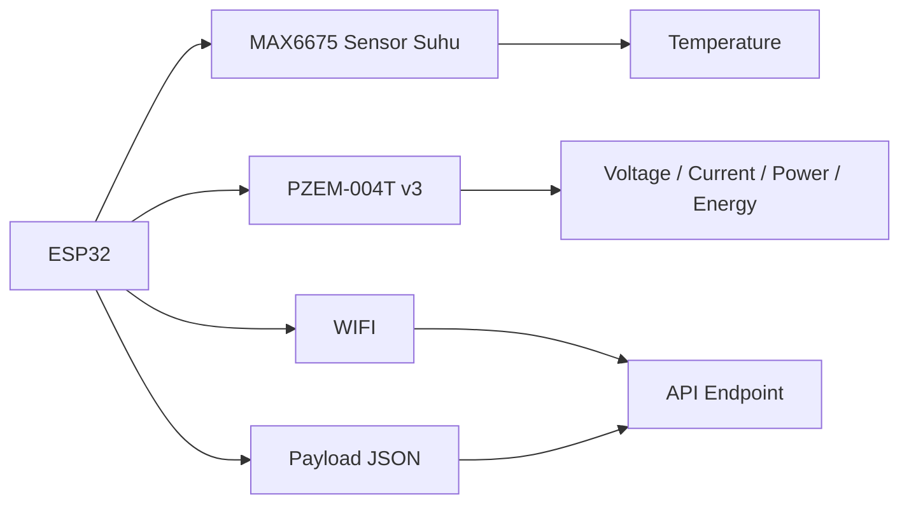
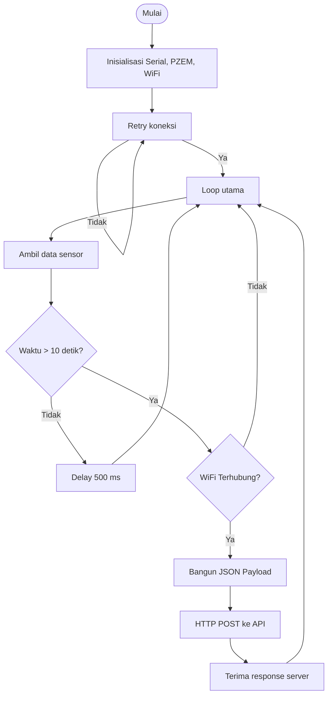

# Dokumen Teknis: Sistem Monitoring Mesin Berbasis ESP32

<div align="center">
  
  <br>
  <h3>⚙️ Monitoring Suhu, Arus, Daya, dan Kelembaban Mesin</h3>
</div>

## 1. Gambaran Umum

Program ini dibuat untuk memonitor kondisi mesin berbasis mikrokontroler ESP32. Data yang dikirim meliputi:

- Suhu mesin menggunakan sensor `MAX6675`
- Tegangan, arus, daya, dan energi menggunakan sensor `PZEM-004T v3`
- Kelembaban tanah / moist (pada kode saat ini masih bersifat dummy karena sensor belum terhubung)
- Mengirim hasil pembacaan ke server API melalui koneksi WiFi

Sistem ini bekerja secara otomatis tanpa layar LCD, sehingga fokus utama adalah membaca sensor, mengolah data, dan mengirimnya ke backend secara berkala.

---

## 2. Logo / Simbol Sistem

```text
      ┌───────────────────────┐
      │       ESP32           │
      │   ┌───────────────┐   │
      │   │  MAX6675      │   │  ← Suhu mesin
      │   └───────────────┘   │
      │          │            │
      │   ┌───────────────┐   │
      │   │  PZEM-004T    │   │  ← Tegangan / Arus / Daya
      │   └───────────────┘   │
      │          │            │
      │   ┌───────────────┐   │
      │   │  Internet     │   │  ← WiFi / HTTP API
      │   └───────────────┘   │
      └──────────┬────────────┘
                 │
                 v
       ┌────────────────────────────┐
       │  API Server IoT 7K         │
       │  https://mgt.iot7k.com     │
       └────────────────────────────┘
```

### Simbol Peta Aliran

- 🔥 = sensor suhu
- ⚡ = sensor daya dan listrik
- 🌐 = koneksi internet
- 📡 = pengiriman data ke server
- 🧠 = pemrosesan data lokal ESP32

---

## 3. Arsitektur Sistem



Dari diagram di atas, ESP32 berperan sebagai pengumpul data sensor, pengolah data, lalu pengirim data ke endpoint API melalui jaringan WiFi.

---

## 4. Komponen Utama pada Source Code

### 4.1 Library yang Digunakan

```cpp
#include <WiFi.h>
#include <HTTPClient.h>
#include <max6675.h>
#include <PZEM004Tv30.h>
```

Penjelasan singkat:

- `WiFi.h` → menangani koneksi ESP32 ke jaringan WiFi
- `HTTPClient.h` → mengirim data ke server menggunakan HTTP POST
- `max6675.h` → library untuk membaca sensor suhu MAX6675
- `PZEM004Tv30.h` → library untuk membaca sensor PZEM-004T v3

---

### 4.2 Konfigurasi WiFi

```cpp
const char* ssid     = "7k produksi";
const char* password = "tujukuda777";
const char* endpoint = "https://mgt.iot7k.com/api/machine-readings";
```

Kode di atas berfungsi untuk:

- Menghubungkan ESP32 ke jaringan WiFi tertentu
- Menentukan URL endpoint API yang akan menerima data

Pada beberapa versi, WiFi bisa diubah sesuai lokasi kerja atau jaringan produksi. Untuk keamanan, biasanya credential sebaiknya disimpan di file konfigurasi yang aman dan tidak dicetak ke repo publik.

---

### 4.3 Sensor Suhu MAX6675

```cpp
#define THERMO_SCK 18
#define THERMO_CS  5
#define THERMO_SO  19
MAX6675 thermocouple(THERMO_SCK, THERMO_CS, THERMO_SO);
```

Penjelasan pin:

- `SCK` = clock pin
- `CS` = chip select pin
- `SO` = serial output pin

Sensor MAX6675 membaca suhu dari thermocouple dan menghasilkan nilai dalam satuan Celsius melalui fungsi:

```cpp
float temp = thermocouple.readCelsius();
```

---

### 4.4 Sensor PZEM-004T v3

```cpp
#define PZEM_RX 16
#define PZEM_TX 17
HardwareSerial pzemSerial(2);
PZEM004Tv30 pzem(pzemSerial, PZEM_RX, PZEM_TX);
```

Fungsi:

- `PZEM_RX` dan `PZEM_TX` adalah pin UART yang dipakai komunikasi serial
- `HardwareSerial pzemSerial(2);` membuat serial hardware ke-2 untuk modul PZEM
- `pzem.voltage()` → tegangan
- `pzem.current()` → arus
- `pzem.power()` → daya
- `pzem.energy()` → energi

Data dari PZEM dipercayai cukup akurat untuk kebutuhan monitoring konsumsi listrik mesin.

---

## 5. Fungsi Helper

### 5.1 `safeValue()`

```cpp
float safeValue(float value) {
  return isnan(value) ? 0.0 : value;
}
```

Fungsi ini digunakan untuk mencegah nilai `NaN` (Not a Number) muncul ke server. Jika sensor tidak valid, nilai otomatis diubah menjadi `0.0`.

Hal ini penting agar backend tidak menerima data invalid atau error parsing JSON.

---

## 6. Proses Koneksi WiFi

```cpp
void connectWiFi() {
  WiFi.begin(ssid, password);
  Serial.print("WiFi connecting");

  while (WiFi.status() != WL_CONNECTED) {
    delay(500);
    Serial.print(".");
  }

  Serial.println();
  Serial.println("WiFi connected");
  delay(1000);
}
```

Proses kerja:

1. ESP32 mencoba terhubung ke SSID dan password tertentu
2. Sistem menunggu hingga `WL_CONNECTED`
3. Setelah terhubung, serial monitor menampilkan status koneksi
4. Delay 1 detik untuk memastikan stabilisasi koneksi

Jika WiFi gagal, perangkat tidak akan bisa mengirim data ke server.

---

## 7. Fungsi `setup()`

```cpp
void setup() {
  Serial.begin(115200);

  pzemSerial.begin(9600, SERIAL_8N1, PZEM_RX, PZEM_TX);

  connectWiFi();
}
```

Alur setup:

- `Serial.begin(115200)` membuka komunikasi serial monitor
- `pzemSerial.begin(...)` mengaktifkan komunikasi serial dengan modul PZEM
- `connectWiFi()` memulai koneksi internet

Pada tahap ini, semua komponen utama dibangun dan siap bekerja.

---

## 8. Fungsi `loop()` dan Siklus Kerja

```cpp
void loop() {
  float temp = thermocouple.readCelsius();
  int soil = 0;

  float voltage = pzem.voltage();
  float current = pzem.current();
  float power   = pzem.power();
  float energy  = pzem.energy();

  const char* machine_id_val = "MESIN-20";

  if (millis() - lastSend > SEND_INTERVAL) {
    lastSend = millis();

    if (WiFi.status() == WL_CONNECTED) {
      HTTPClient http;
      http.begin(endpoint);
      http.setFollowRedirects(HTTPC_STRICT_FOLLOW_REDIRECTS);
      http.addHeader("Content-Type", "application/json");

      float safeVoltage = safeValue(voltage);
      float safeCurrent = safeValue(current);
      float safePower = safeValue(power);
      float safeTemp = safeValue(temp);

      String payload = "{";
      payload += "\"machine_id\":\"" + String(machine_id_val) + "\",";
      payload += "\"amp\":"        + String(safeCurrent, 3) + ",";
      payload += "\"hm\":"         + String(safePower, 2)   + ",";
      payload += "\"temp\":"       + String(safeTemp, 2)    + ",";
      payload += "\"moist\":"      + String(soil);
      payload += "}";

      int code = http.POST(payload);
      ...
    }
  }

  delay(500);
}
```

### Penjelasan siklus:

1. Baca data sensor:
   - suhu dari `MAX6675`
   - tegangan, arus, daya, energi dari `PZEM`
   - kelembaban diset 0 karena sensor belum didefinisikan

2. Lakukan pengecekan interval pengiriman:
   - `SEND_INTERVAL = 10000` ms = 10 detik
   - artinya data dikirim setiap 10 detik

3. Cek koneksi WiFi:
   - jika terhubung, program akan mengirim HTTP POST

4. Buat payload JSON:
   - `machine_id` = identitas mesin
   - `amp` = arus
   - `hm` = daya / power
   - `temp` = suhu mesin
   - `moist` = kelembaban

5. Kirim data ke API server

6. Delay 500 ms agar loop tidak terlalu cepat berulang

---

## 9. Format Payload JSON

Setelah data dibaca, program membangun JSON seperti berikut:

```json
{
  "machine_id": "MESIN-20",
  "amp": 1.234,
  "hm": 230.5,
  "temp": 45.2,
  "moist": 0
}
```

### Penjelasan field:

- `machine_id` → identitas unit mesin
- `amp` → arus listrik (A)
- `hm` → daya atau konsumsi listrik (Watt)
- `temp` → suhu mesin (°C)
- `moist` → kelembaban tanah atau kondisi kelembapan (nilai sementara 0)

---

## 10. Diagram Alur Logika Program



---

## 11. Catatan Penting dalam Kode

### 11.1 Sensor kelembaban belum aktif

```cpp
// #define HIGRO 34
// int soil = analogRead(HIGRO);
int soil = 0;
```

Kode ini menunjukkan sensor kelembaban masih dinonaktifkan atau belum terhubung. Saat ini, nilai `moist` dikirim sebagai `0`. Untuk sistem yang lengkap, Anda dapat mengaktifkan sensor analog dan mengambil nilai dari pin `HIGRO`.

### 11.2 Redirect HTTP

```cpp
http.setFollowRedirects(HTTPC_STRICT_FOLLOW_REDIRECTS);
```

Baris tersebut bertujuan memastikan request mengikuti redirect yang lebih ketat agar API server tidak mengalami masalah redirect dan gagal menerima payload.

### 11.3 Manajemen nilai error

```cpp
float safeValue(float value) {
  return isnan(value) ? 0.0 : value;
}
```

Fungsi ini sangat berguna untuk menanggulangi pembacaan sensor yang tidak valid atau menghasilkan `NaN`.

---

## 12. Potensi Pengembangan Selanjutnya

Agar sistem lebih profesional dan siap produksi, beberapa pengembangan yang disarankan:

- ✅ Tambahkan sensor kelembaban tanah yang benar-benar terhubung
- ✅ Simpan credential WiFi dalam file konfigurasi yang aman
- ✅ Tambahkan retry logic jika POST gagal
- ✅ Tambahkan log ke SD card atau EEPROM
- ✅ Tambahkan watchdog agar ESP32 tetap stabil
- ✅ Gunakan HTTPS certificate yang valid dan aman
- ✅ Tambahkan mekanisme deep sleep untuk efisiensi daya

---

## 13. Kesimpulan

Program `esp32-no-lcd-moist.ino` adalah contoh sistem monitoring mesin berbasis ESP32 yang cukup sederhana namun efektif. Program ini berhasil:

- membaca data dari sensor suhu dan sensor listrik,
- memvalidasi data agar aman dikirim,
- terhubung ke WiFi,
- mengirim data ke server API menggunakan JSON,
- mengotomatisasi proses monitoring tanpa LCD.

Dengan struktur ini, sistem dapat dikembangkan lebih lanjut menjadi solusi monitoring mesin yang lebih lengkap, presisi, dan scalable untuk kebutuhan industri atau produksi.

---

<div align="center">
  
  <br>
  <strong>📡 ESP32 Monitoring System</strong>
</div>
